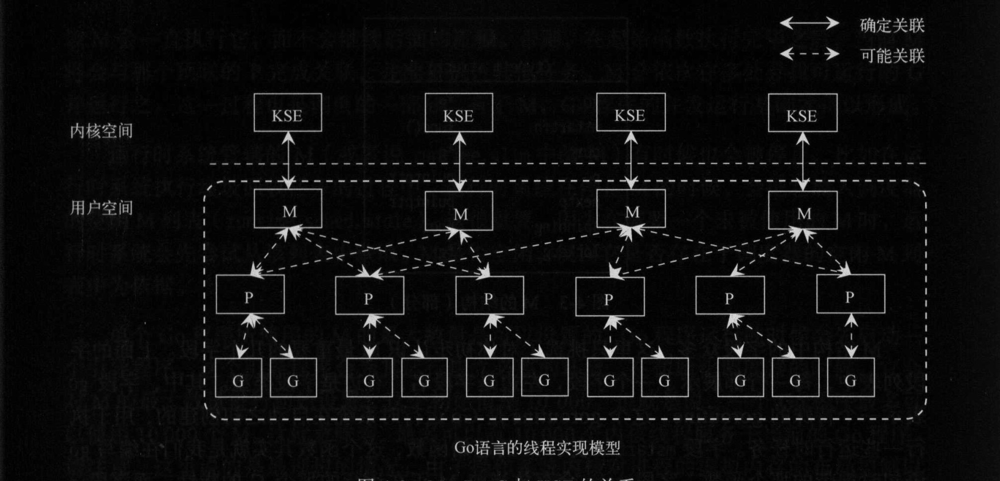

## 操作系统的线程（thread）和进程（process）

当操作系统运行一个应用程序的时候，os会为这个程序启动一个进程。可以说这个进程是一个包含了应用程序在运行中需要用到和维护的各种资源的容器
* 进程是具有一定独立功能的程序关于某个数据集合上的一次运行活动,进程是系统进行资源分配和调度的一个独立单位。每个进程都有自己的独立内存空间，不同进程通过进程间通信来通信。由于进程比较重量，占据独立的内存，所以上下文进程间的切换开销（栈、寄存器、虚拟内存、文件句柄等）比较大，但相对比较稳定安全

* 线程 线程是进程的一个实体,是CPU调度和分派的基本单位,它是比进程更小的能独立运行的基本单位.线程自己基本上不拥有系统资源,只拥有一点在运行中必不可少的资源(如程序计数器,一组寄存器和栈),但是它可与同属一个进程的其他的线程共享进程所拥有的全部资源。线程间通信主要通过共享内存，上下文切换很快，资源开销较少，但相比进程不够稳定容易丢失数据。

* 协程是一种用户态的轻量级线程，协程的调度完全由用户控制。协程拥有自己的寄存器上下文和栈。协程调度切换时，将寄存器上下文和栈保存到其他地方，在切回来的时候，恢复先前保存的寄存器上下文和栈，直接操作栈则基本没有内核切换的开销，可以不加锁的访问全局变量，所以上下文的切换非常快。

#### 多进程编程

Linux中支持IPC的方法有很多种。从处理机制看 可分为基于通信的IPC方法、基于信号的IPC方法、基于同步的IPC方法。
其中，基于通信的IPC方法又分为以数据传送为手段的IPC方法和一共享内存为手段的IPC方法，前者包含了管道和消息队列。
管道可以用来传送字节流、消息队列可以用来传送结构化的消息对象。以共享内存为手段的IPC方法主要以共享内存区为代表，他是最快的一种IPC方法。
基于信号的IPC方法就是我们常说的os的信号机制，他是惟一异步的IPC方法。

*Go中支持IPC的方法有管道、信号、和socket*

* 进程的状态

1. 可运行状态 R
2. 可中断的睡眠状态 S
3. 不可中断的睡眠状态 D
4. 暂停状态或者跟踪状态 T
5. 僵尸状态 Z  处于此状态的进程即将结束运行 该进程占用的绝大多数资源也已经回收 ，不过还有一些信息未删除，比如退出码以及一些统计信息。之所以保留
   这些信息，主要是考虑到该进程的父进程可能需要他们。
6. 退出状态 X

### 线程的实现模型

KSE 内核调度实体 顾名思义 内核调度实体就是可以被内核的调度器调度的对象。也成为内核级线程，是os内核调度的最小调度单元。

* 用户级线程模型 多对一
* 内核级线程模型 一对一
* 两级线程模型  多对多

#### 线程调度模型GMP

M 一个M代表一个内核线程
P 一个P代表执行一个Go代码片段所必须的资源（上下文资源）
G 一个G代表一个Go代码片段 。

一个G的执行需要P和M的支持。一个M在和一个P关联之后，就形成一个G的有效的运行环境。M与KSE之间总是一对一的关系，一个M在其生命周期内，会且仅会与一个KSE产生关联。M与P见也总是一对一的关系，而P与G之间则是一对多的关系。而M与G之间也会建立关联，因为一个G终归是由一个M负责运行。



#### M
##### M的结构
一个M代表一个内核线程，M的结构如下：
```
type m struct {
   g0      *g               // OS在启动之初为M分配的一个特殊的G
   mstartfn      func()     // m的启动函数
   curg          *g         // 当前运行的g的指针
   p             puintptr   // 当前m相关联的p
   nextp         puintptr   // 临时存放p
   spinning      bool       // 自旋状态表示当前M是否在寻找可运行G 
   park          note       // 休眠锁
   schedlink     muintptr   // 链表
   ...
}
```
##### M的创建
```go
// Create a new m. It will start off with a call to fn, or else the scheduler.
// fn needs to be static and not a heap allocated closure.
// May run with m.p==nil, so write barriers are not allowed.
//go:nowritebarrierrec
//创建一个新的m。它将以对fn或调度程序的调用开始。
func newm(fn func(), _p_ *p) {
   //创建一个M对象
   mp := allocm(_p_, fn)
   //设置当前M的下一个P为_p_
   mp.nextp.set(_p_)
   ...
   newm1(mp)
}

func newm1(mp *m) {
   if iscgo {
      //cgo的一些处理
      ...
   }
   //创建系统线程
   execLock.rlock() // Prevent process clone.
	newosproc(mp)
	execLock.runlock()
}
```
在os_linux.go中
```go
func newosproc(mp *m) {
   //g0的栈内存地址
   stk := unsafe.Pointer(mp.g0.stack.hi)
   ...
   sigprocmask(_SIG_SETMASK, &sigset_all, &oset)
   //系统调用
	ret := clone(cloneFlags, stk, unsafe.Pointer(mp), unsafe.Pointer(mp.g0), unsafe.Pointer(funcPC(mstart)))
   sigprocmask(_SIG_SETMASK, &oset, nil)
   ...
}
```
关于m对象的创建
```go
func allocm(_p_ *p, fn func()) *m {
   
}
```

M在创建之处，会被加入到全局的M列表中，运行时系统会为这个M专门创建一个新的内核线程并与之相关联。

M在系统停止M的时候，会被放入调度器的空闲M列表

* 什么时候创建新的M？
  当M因为系统调用而阻塞的时候，系统会把M和与之关联的P分离开来。这时，如果这个P的可运行队列中还有未被运行的G，那么系统会找到一个空闲的M或者创建一个新的M，并与该P关联以满足这些G的运行需要。

#### P
P是G能够在M中运行的关键。
全局P列表，包含了当前运行时系统创建的所有P。
空闲P列表，当一个P不在于任何M相关联，运行时系统就会把它放入该列表，而当运行时系统需要一个空闲P关联某个M时，会从该列表取出一个；*P进入空闲列表的前提是他的可运行G列表必须为空*

*状态*
1. Pidle 表明当前P未与任何M存在关联
2. Prunning 表明当前P正在与某个M关联
3. Psyscall 表明当前P中运行的G正在进行系统调用
4. Pgcstop 运行时系统需要停止调度
5. Pdead 表明当前P已经不会再被使用

 可运行G队列
 自由G列表

* 为什么P的默认数量是CPU的总核心数？
* P和M是如何绑定的？

#### G

全局G列表
调度器可运行G队列
调度器自由G列表

#### 一轮调度

在一轮调度的开始，调度器会先判断当前M是否已经锁定，如果发现当前M已经与某个G锁定，就会立即停止调度并停止当前M。一旦与他锁定的G处于可运行状态，他就唤醒并继续运行那个G。

如果当前M并未与任何G锁定，调度器会检查是否有运行时串行任务正在等待执行，如果有M会被停止并阻塞已等待运行时串行任务执行完成。一旦该串行任务执行完成，该M就会被唤醒。

调度器首先会从全局可运行G队列和本地P队列查找可运行的G，如果找不到，调度器会进入强力查找模式，如果还找不到的话，该子流程就会暂停，直到有可运行的G的出现才会继续下去。

如果找到可运行的G，调度器会判断该G未与任何M锁定的情况下，立即让当前M运行它。如果G已经锁定，那么调度器会唤醒与该G锁定的M并运行该G，停止当前M直到被唤醒。

