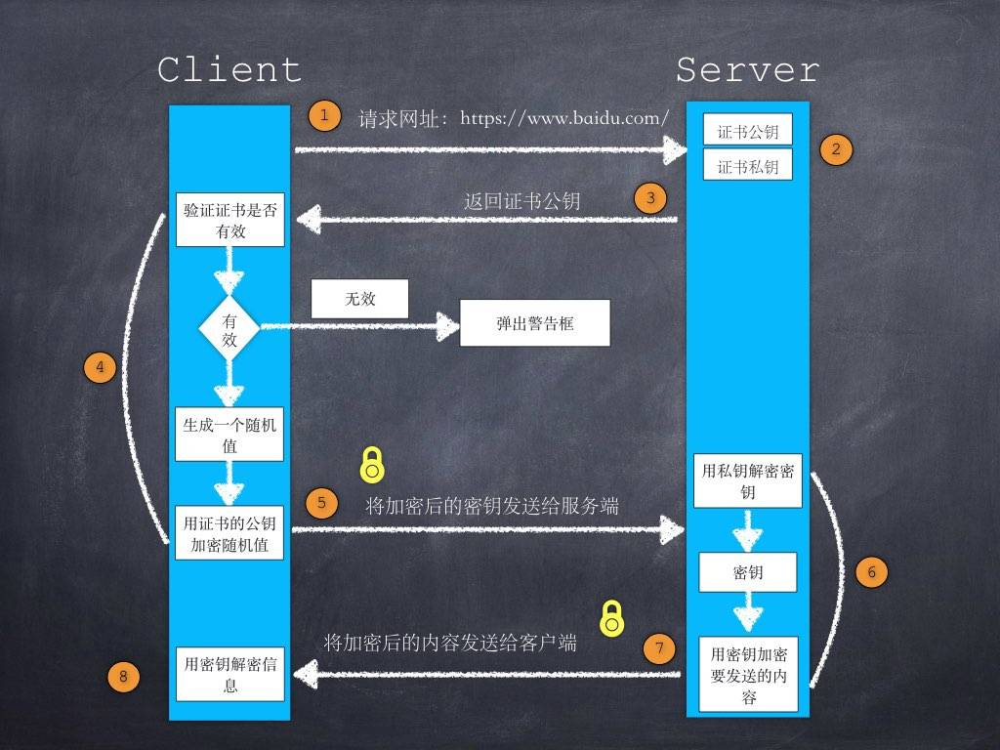

#### 无状态协议

HTTP自身不对请求和响应之间的通信状态进行保存，协议对于发送过的请求或响应都不做持久化处理。

#### 协议格式
### URI

HTTP使用统一资源标识符（URI）来传输数据和建立连接。URL（统一资源定位符）是一种特殊种类的URI，包含了用于查找的资源的足够的信息，我们一般常用的就是URL，而一个完整的URL包含下面几部分：
1. 协议部分
该URL的协议部分为http:，表示网页用的是HTTP协议，后面的//为分隔符
2. 域名部分
域名是www.fishbay.cn，发送请求时，需要向DNS服务器解析IP。如果为了优化请求，可以直接用IP作为域名部分使用
3. 端口部分
域名后面的80表示端口，和域名之间用:分隔，端口不是一个URL的必须的部分。如果端口是80，也可以省略不写
4. 虚拟目录部分
从域名的第一个/开始到最后一个/为止，是虚拟目录的部分。其中，虚拟目录也不是URL必须的部分，本例中的虚拟目录是/mix/
5. 文件名部分
从域名最后一个/开始到?为止，是文件名部分；如果没有?，则是从域名最后一个/开始到#为止，是文件名部分；如果没有?和#，那么就从域名的最后一个/从开始到结束，都是文件名部分。本例中的文件名是76.html，文件名也不是一个URL的必须部分，如果没有文件名，则使用默认文件名
6. 锚部分
从#开始到最后，都是锚部分。本部分的锚部分是first，锚也不是一个URL必须的部分
7. 参数部分
从?开始到#为止之间的部分是参数部分，又称为搜索部分、查询部分。本例中的参数是name=kelvin&password=123456，如果有多个参数，各个参数之间用&作为分隔符。

### req resp
HTTP报文分为HTTP请求报文和响应报文，请求报文由请求行（请求方法，请求资源的URL和HTTP的版本）、首部行和实体（通常不用）组成。响应报文由状态行（状态码，短语和HTTP版本）、首部行和实体（有些不用）组成。

#### 一次http调用流程

①先检查输入的URL是否合法，然后查询浏览器的缓存，如果有则直接显示。

②通过DNS域名解析服务解析IP地址，先从浏览器缓存查询、然后是操作系统和hosts文件的缓存，如果没有查询本地服务器的缓存。

③通过TCP的三次握手机制建立连接，建立连接后向服务器发送HTTP请求，请求数据包。

④服务器收到浏览器的请求后，进行处理并响应。

⑤浏览器收到服务器数据后，如果可以就存入缓存。

⑥浏览器发送请求内嵌在HTML中的资源，例如css、js、图片和视频等，如果是未知类型会弹出对话框。

⑦浏览器渲染页面并呈现给用户。

#### http请求

GET：向特定的资源发出请求。
POST：向指定资源提交数据进行处理请求（例如提交表单或者上传文件）。数据被包含在请求体中。POST请求可能会导致新的资源的创建和/或已有资源的修改。
OPTIONS：返回服务器针对特定资源所支持的HTTP请求方法。也可以利用向Web服务器发送'*'的请求来测试服务器的功能性。
HEAD：向服务器索要与GET请求相一致的响应，只不过响应体将不会被返回。这一方法可以在不必传输整个响应内容的情况下，就可以获取包含在响应消息头中的元信息。
PUT：向指定资源位置上传其最新内容。
DELETE：请求服务器删除Request-URI所标识的资源。
TRACE：回显服务器收到的请求，主要用于测试或诊断。
CONNECT：HTTP/1.1协议中预留给能够将连接改为管道方式的代理服务器。
虽然HTTP的请求方式有8种，但是我们在实际应用中常用的也就是get和post，其他请求方式也都可以通过这两种方式间接的来实现。

* GET和POST的区别
1、get参数通过url传递，post放在request body中。
2、get请求在url中传递的参数是有长度限制的，而post没有。
3、get比post更不安全，因为参数直接暴露在url中，所以不能用来传递敏感信息。
4、get请求只能进行url编码，而post支持多种编码方式。
5、get请求会浏览器主动cache，而post支持多种编码方式。
6、get请求参数会被完整保留在浏览历史记录里，而post中的参数不会被保留。
7、GET和POST本质上就是TCP链接，并无差别。但是由于HTTP的规定和浏览器/服务器的限制，导致他们在应用过程中体现出一些不同。
8、GET产生一个TCP数据包；POST产生两个TCP数据包。
  
#### https

* Http和Https的区别
Http协议运行在TCP之上，明文传输，客户端与服务器端都无法验证对方的身份；Https是身披SSL(Secure Socket Layer)外壳的Http，运行于SSL()上，SSL运行于TCP之上，是添加了加密和认证机制的HTTP。二者之间存在如下不同：

端口不同：Http与Http使用不同的连接方式，用的端口也不一样，前者是80，后者是443；
资源消耗：和HTTP通信相比，Https通信会由于加减密处理消耗更多的CPU和内存资源；
开销：Https通信需要证书，而证书一般需要向认证机构购买；
Https的加密机制是一种共享密钥加密和公开密钥加密并用的混合加密机制。

* https的过程

证书验证机制
1. 客户端获取到了站点证书，拿到了站点的公钥；
2. 要验证站点可信后，才能使用其公钥，因此客户端找到其站点证书颁发者的信息；
3. 站点证书的颁发者验证了服务端站点是可信的，但客户端依然不清楚该颁发者是否可信；
4. 再往上回溯，找到了认证了中间证书商的源头证书颁发者。由于源头的证书颁发者非常少，我们浏览器之前就认识了，因此可以认为根证书颁发者是可信的；
5. 一路倒推，证书颁发者可信，那么它所颁发的所有站点也是可信的，最终确定了我们所访问的服务端是可信的；
6. 客户端使用证书中的公钥，继续完成TLS的握手过程

#### http2.0
* http2.0和1.*的区别

1. 新的二进制格式（Binary Format），HTTP1.x的解析是基于文本。基于文本协议的格式解析存在天然缺陷，文本的表现形式有多样性，要做到健壮性考虑的场景必然很多，二进制则不同，只认0和1的组合。基于这种考虑HTTP2.0的协议解析决定采用二进制格式，实现方便且健壮。

2. 多路复用（MultiPlexing），即连接共享，即每一个request都是是用作连接共享机制的。一个request对应一个id，这样一个连接上可以有多个request，每个连接的request可以随机的混杂在一起，接收方可以根据request的 id将request再归属到各自不同的服务端请求里面。

3. header压缩，如上文中所言，对前面提到过HTTP1.x的header带有大量信息，而且每次都要重复发送，HTTP2.0使用encoder来减少需要传输的header大小，通讯双方各自cache一份header fields表，既避免了重复header的传输，又减小了需要传输的大小。
HTTP/2 使用的压缩方式是 HPACK。 http://http2.github.io/http2-spec/compression.html

4. 服务端推送（server push），同SPDY一样，HTTP2.0也具有server push功能。
   
#### 多路复用的实现 http2.0 多路复用
* 帧 HTTP/2 中数据传输的最小单位 它把数据报的两大部分分成了 header frame 和 data frame。也就是头部帧和数据体帧。 
* 流 流可以承载双向消息，每个流都有一个唯一的整数 ID。

帧代表着最小的数据单位，每个帧会标识出该帧属于哪个流，流也就是多个帧组成的数据流。
HTTP2 采用二进制数据帧传输，取代了 HTTP1.x 的文本格式，二进制格式解析更高效。
多路复用代替了 HTTP1.x 的序列和阻塞机制，所有的相同域名请求都通过同一个 TCP 连接并发完成。同一 Tcp 中可以发送多个请求，对端可以通过帧中的标识知道属于哪个请求。通过这个技术，可以避免 HTTP 旧版本中的队头阻塞问题，极大的提高传输性能。
 
#### http代理
Web代理（proxy）服务器是网络的中间实体。

* 代理和网关的区别
  严格来说，代理连接的是两个或者多个使用相同协议的应用程序，而网关连接的则是两个或者多个使用不同协议的端点。
  网关扮演的是“协议转换器”的角色，即使客户端和服务器使用的是不同的协议，客户端也可以通过它完成与服务器之间的事务处理。

* 反向代理
  接收发送给web服务器的请求，也可以发起与其他服务器的通信，以便按需定位所请求的内容。
  反向代理可以用来提高访问慢速web服务器上公共内容时的性能。在这种配置中，通常将这些反向代理称为*服务器加速器*还可以与内容路由功能配合使用，以创建按需复制内容的分布式网络。
  
#### http keepalive
客户端可以通过包含Connection:keep-Alive首部请求将一条连接保持在打开状态。
握手过程
客户端发送一个请求在首部包含Connection:keep-Alive，如果服务器愿意为下一条请求保持打开状态，就会在响应中包含相同的首部。如果响应中没有Connection:keep-Alive，客户端就认为服务器不支持keep-alive，会在发回响应报文之后关闭连接
#### 常见httpcode

* 100-199 信息性状态吗
* 200-299 成功状态码
  | http状态码   | 描述                                   |
  | ------------ | -------------------------------------- |
  | 200   OK     | OK，文档返回正确                       |
  | 201 Created  | 用于创建服务器对象的请求               |
  | 202 Accepted | 请求已被接收，但服务器还未执行任何动作 |
* 300-399 重定向状态码 
| http状态码            | 描述                                                             |
| --------------------- | ---------------------------------------------------------------- |
| 300                   | 客户端请求一个实际指向多个资源的URL时返回                        |
| 301 Moved Permanently | 在请求的URL被移出时使用。响应的Location首部应当包含现在所处的URL |
| 302   Found           | 重定向，客户端应该使用Location手部给出的URL来临时定位资源        |
| 305 UseProxy          | 用来说明必须通过代理访问资源，代理位置由location首部给出         |
* 400-499 客户端错误状态码
| http状态码       | 描述                                     |
| ---------------- | ---------------------------------------- |
| 400  Bad Request | 发送了一个错误的请求                     |
| 401 Unauthorized | 与适当的首部一同返回，请求客户端需要认证 |
| 403  Forbidden   | 请求被服务器拒绝                         |
| 404  NotFound    | 找不到所请求的URL                        |
* 500-599 服务器错误状态码
| http状态码                 | 描述                                                       |
| -------------------------- | ---------------------------------------------------------- |
| 500  Internal Server Error | 服务器遇到妨碍他为请求工服务的错误                         |
| 501 Not Implemented        | 服务器不支持当前的请求                                     |
| 502  Bad Gateway           | 作为代理或者网关从请求响应链的下一条链路上收到了一条伪响应 |
| 503 Service Unavailable    | 用来说明服务器仙子无法为请求提供服务，但将来可以           |